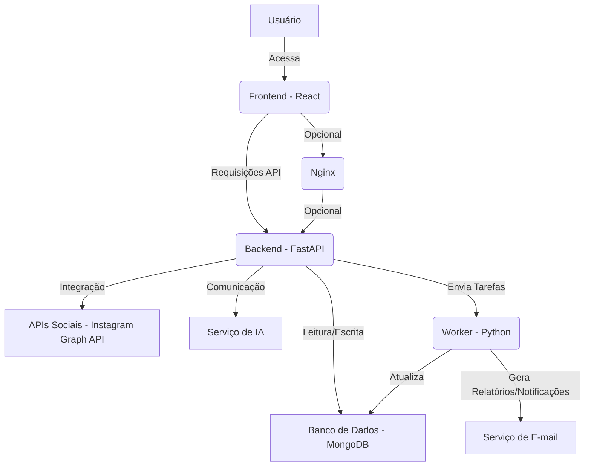

# Arquitetura e Design do Sistema SaaS para Criadores UGC

Este documento detalha a arquitetura e o design do sistema SaaS proposto para criadores de conteúdo UGC, abrangendo os requisitos técnicos e funcionais especificados. O objetivo é criar uma plataforma modular, escalável e totalmente dockerizada, garantindo facilidade de deploy e manutenção.

## 1. Visão Geral da Arquitetura

A arquitetura do sistema será baseada em microsserviços, com componentes desacoplados que se comunicam via APIs. Isso permitirá escalabilidade independente de cada serviço e facilitará a manutenção e a adição de novas funcionalidades. A infraestrutura será totalmente containerizada usando Docker e orquestrada com Docker Compose para um ambiente de desenvolvimento e produção consistente.

### Componentes Principais:

*   **Frontend:** Interface do usuário (Dashboard) desenvolvida em React, Tailwind CSS e shadcn/ui.
*   **Backend (API Gateway/Serviços):** Lógica de negócios, gerenciamento de dados e integração com APIs externas, desenvolvido em Python (FastAPI).
*   **Banco de Dados:** MongoDB para persistência de dados.
*   **Worker:** Serviço assíncrono para processamento de tarefas em segundo plano, como geração de relatórios e notificações, também em Python.
*   **Serviço de Autenticação:** Integrado ao backend, utilizando JWT com refresh token.
*   **Serviço de IA:** Módulos de inteligência artificial para feedback e sugestões de conteúdo.
*   **Nginx (Opcional):** Como proxy reverso para o frontend e backend, e para servir arquivos estáticos.

O diagrama a seguir ilustra a interação entre os componentes:

## 2. Detalhamento dos Componentes

### 2.1. Frontend

*   **Tecnologias:** React, Tailwind CSS, shadcn/ui, Recharts (para gráficos).
*   **Funcionalidades:**
    *   Login/Logout e gerenciamento de sessão.
    *   Dashboard com overview do perfil do criador.
    *   Visualização de gráficos de evolução (seguidores, engajamento, alcance).
    *   Exibição de notas automáticas e feedback textual para posts/reels.
    *   Download de relatórios em PDF.
    *   Cadastro e edição de perfil (nicho de atuação).
    *   Interface responsiva para desktop e mobile.
*   **Comunicação:** Interage com o Backend via requisições HTTP (RESTful API).

### 2.2. Backend

*   **Tecnologias:** Python (FastAPI).
*   **Funcionalidades:**
    *   **Autenticação e Autorização:** Gerenciamento de usuários, login, registro, JWT com refresh token.
    *   **Gerenciamento de Perfis:** CRUD para perfis de criadores, incluindo nicho de atuação.
    *   **Integração com APIs Sociais:** Conexão com Instagram Graph API para coletar dados de seguidores, posts, reels e engajamento.
    *   **API para Dados de Performance:** Endpoint para o frontend consumir dados de métricas e relatórios.
    *   **Comunicação com Worker:** Envio de tarefas para o worker (ex: agendar geração de relatórios).
    *   **Comunicação com Serviço de IA:** Envio de dados de posts para análise e recebimento de feedback/sugestões.
    *   **Gerenciamento de Assinaturas:** Lógica para os modelos de negócio (pagamento único, assinatura mensal, upgrades).
*   **Estrutura:** Organizado em módulos (ex: `auth`, `users`, `profiles`, `social_integrations`, `reports`, `ai_insights`).

### 2.3. Banco de Dados (MongoDB)

*   **Tecnologia:** MongoDB (NoSQL Document Database).
*   **Coleções Propostas:**
    *   `users`: Armazena informações de autenticação do usuário (email, senha hash, roles).
    *   `profiles`: Detalhes do perfil do criador (ID do usuário, nome, nicho, links sociais, tokens de acesso para APIs sociais).
    *   `metrics`: Dados brutos e processados de performance coletados das APIs sociais (seguidores, engajamento por post, alcance, etc.). Indexado por criador e data.
    *   `reports`: Metadados dos relatórios gerados (ID do criador, período, link para PDF, status).
    *   `posts_feedback`: Feedback gerado por IA para posts/reels específicos (ID do post, texto do feedback, notas, sugestões).
*   **Persistência:** Utilização de volumes Docker para garantir a persistência dos dados.

### 2.4. Worker

*   **Tecnologias:** Python, Celery (ou similar) para gerenciamento de filas e tarefas assíncronas.
*   **Funcionalidades:**
    *   **Coleta Periódica de Dados:** Executa tarefas agendadas para coletar métricas das APIs sociais (Instagram Graph API).
    *   **Geração de Relatórios:** Processa os dados coletados para gerar relatórios de performance (semanal/mensal).
    *   **Análise de IA:** Envia dados de posts para o serviço de IA e armazena os resultados (feedback, sugestões).
    *   **Notificações:** Envia e-mails aos criadores quando novos relatórios estão disponíveis.
*   **Execução:** Rodará como um serviço Docker separado, com cron jobs ou um scheduler interno (ex: `APScheduler` ou `Celery Beat`).

### 2.5. Serviço de IA

*   **Tecnologias:** Python (com bibliotecas de NLP/ML como Transformers, scikit-learn, etc.).
*   **Funcionalidades:**
    *   **Análise de Posts/Reels:** Recebe o conteúdo de posts (texto, descrição, talvez metadados da imagem/vídeo) e gera notas e feedback textual.
    *   **Sugestões de Conteúdo:** Baseado no nicho do criador e nos dados de performance, gera sugestões personalizadas de conteúdo, horários de postagem e estratégias de engajamento.
*   **Integração:** Exposto como uma API interna ou como um módulo importado pelo Worker/Backend.

### 2.6. Autenticação

*   **Mecanismo:** JSON Web Tokens (JWT) com refresh tokens.
*   **Fluxo:**
    1.  Usuário faz login com email/senha.
    2.  Backend verifica credenciais e retorna um `access_token` (curta duração) e um `refresh_token` (longa duração).
    3.  `access_token` é usado para autenticar requisições à API.
    4.  Quando `access_token` expira, o `refresh_token` é usado para obter um novo `access_token` sem a necessidade de login novamente.

## 3. Infraestrutura e Dockerização

### 3.1. Dockerfiles

*   **Backend:** Dockerfile para a aplicação FastAPI, instalando dependências Python e configurando o servidor (Uvicorn).
*   **Frontend:** Dockerfile para a aplicação React, construindo o projeto e servindo os arquivos estáticos (via Nginx ou um servidor web leve).
*   **Worker:** Dockerfile para o serviço Python do worker, instalando suas dependências.

### 3.2. Docker Compose

O `docker-compose.yml` orquestrará os seguintes serviços:

*   `backend`: Aplicação FastAPI, exposta na porta 8000.
*   `frontend`: Aplicação React, exposta na porta 3000.
*   `mongo`: Imagem oficial do MongoDB, com volume para persistência de dados.
*   `worker`: Serviço para tarefas em segundo plano.
*   `nginx` (Opcional): Proxy reverso para `frontend` e `backend`.

### 3.3. Persistência de Dados

*   Um volume Docker será configurado para o serviço `mongo` (`./data/db:/data/db`), garantindo que os dados do MongoDB persistam mesmo se o container for removido.

### 3.4. Redes e Comunicação

*   Todos os serviços estarão na mesma rede Docker, permitindo a comunicação interna por nomes de serviço (ex: `http://mongo:27017`, `http://backend:8000`).
*   As portas 3000 (frontend) e 8000 (backend, se Nginx não for usado) serão mapeadas para o host local.

## 4. Integrações Externas

### 4.1. Instagram Graph API

*   **Uso:** Coleta de dados de seguidores, posts, reels, engajamento, etc.
*   **Autenticação:** OAuth 2.0, com o criador concedendo permissão para o aplicativo acessar seus dados. Os tokens de acesso serão armazenados de forma segura no MongoDB.
*   **Limitações:** Necessidade de gerenciar limites de taxa da API e renovação de tokens.

### 4.2. Serviço de E-mail

*   **Uso:** Envio de notificações de novos relatórios.
*   **Tecnologia:** Utilização de uma biblioteca Python para SMTP ou integração com um serviço de e-mail transacional (ex: SendGrid, Mailgun).

## 5. Modelo de Negócio

O sistema será projetado para suportar o seguinte modelo de negócio:

*   **Pagamento Único Inicial:** Para análise completa do perfil. Isso pode ser um módulo de pagamento integrado ao backend.
*   **Assinatura Mensal:** Para relatórios automáticos e insights contínuos. Requer um sistema de gerenciamento de assinaturas (ex: Stripe, PagSeguro) integrado ao backend.
*   **Planos Premium:** Possibilidade de upgrades, que podem desbloquear funcionalidades avançadas de IA, relatórios mais detalhados ou suporte prioritário.

## 6. Considerações de Segurança

*   **Autenticação:** JWT seguro, com tokens armazenados em `HttpOnly` cookies (frontend) ou `localStorage` (com devidas precauções).
*   **Autorização:** Controle de acesso baseado em funções (RBAC) para diferentes tipos de usuários (criador, administrador).
*   **Proteção de Dados:** Criptografia de dados sensíveis em repouso (no MongoDB) e em trânsito (HTTPS).
*   **Validação de Entrada:** Todas as entradas de usuário serão validadas para prevenir ataques como injeção de SQL/NoSQL e XSS.
*   **Gerenciamento de Segredos:** Variáveis de ambiente para chaves de API e credenciais de banco de dados.

## 7. Próximos Passos

Com esta arquitetura definida, os próximos passos incluem:

1.  Configuração inicial do ambiente de desenvolvimento.
2.  Criação dos Dockerfiles e `docker-compose.yml`.
3.  Desenvolvimento do Backend (FastAPI) com modelos de dados e endpoints de autenticação.
4.  Desenvolvimento do Frontend (React) com as telas principais.
5.  Integração com MongoDB.
6.  Implementação do Worker e lógica de coleta de dados.
7.  Desenvolvimento dos módulos de IA.
8.  Testes e refinamentos contínuos.

Este documento servirá como guia para o desenvolvimento do projeto, garantindo que todos os requisitos sejam atendidos de forma estruturada e eficiente.

